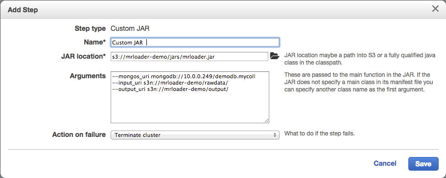

MrLoader
========
##Elastic MapReduce Loader for MongoDB

MrLoader is a framework for using Amazon Elastic MapReduce to load raw data files stored in S3 into MongoDB. 

The high level concept is to use the EMR framework for :

* Managing reading, decompressing, splitting and distributing the data files between the nodes in the EMR cluster
* Invoking a custom Mapper which will parse, batch and insert BSON documents in parallel into MongoDB
* Collect latency data and use the Reduce phase to collate and report latency distribution

While loading data does not initially seem like a good MapReduce use case, there are several advantages to using EMR as a loader client :

* It can handle data stored in thousands of smaller files or very large files and will automatically split and distribute them accordingly. 
* It will provision, configure and run client clusters from 1 to 100's of machines from a single API call or point and click form.
* It reads directly from S3, avoiding the need to transfer the input data to any storage medium directly attached to the nodes running the loader. S3 is a durable, secure and inexpensive way to store large volumes of input data. In addition, when the MrLoader EMR cluster is deployed into the same region as the input data S3 bucket, there are currently no AWS (transfer) charges for reading the data into the cluster.
* EMR configures itelf in minutes and automatically terminates the client cluster when loading is complete, saving on EC2 usage costs.
* EMR manages the collection of logging/output/job latency across the entire cluster and publishes it back to S3

## Deployment Architecture


A typical deployment consists of 3 main components :

* MongoDB - this can be a standalone server, single repica set or a large sharded cluster as pictured. It can be configured manually on a number of EC2 hosts or make use of the [MongoDB Management Service (MMS)](https://mms.mongodb.com) Automation feature to provision and delpoy a cluster in EC2 in minutes. It is recommended that the MongoDB cluster be run in the same Amazon VPC subnet as the EMR cluster.
* S3 Bucket - by convention, an S3 bucket with folders setup for the raw data to be processed, logging to be written and output to be sent. The bucket should ideally be created in the same AWS Availability Zone as the VPC subnet hosting the rest of the system.
* EMR Job/Cluster - An EMR Job started using a "custom jar" step with the jar file generated by the maven project in this repo.

## Getting Started

### Setting up AWS

As previously mentioned, it is recommended (although not required) to run the entire setup in a single VPC subnet. There are some [excellent AWS instructions](http://docs.aws.amazon.com/ElasticMapReduce/latest/DeveloperGuide/emr-plan-vpc-subnet.html) on for setting up a subnet to run EMR. Also consider when defining the subnet address range the maximum number of hosts you will need in total. Depending on the scale you are trying to achieve, you may want to run EMR jobs with upwards of 100 or 200 small nodes. There is also good general documentation on [AWS VPC Subnets](http://docs.aws.amazon.com/AmazonVPC/latest/UserGuide/VPC_Subnets.html).

Next, you will need an S3 bucket in the same availability zone as the VPC hosting the rest of the system. This is easy to create via the S3 console or CLI. Although folders dont need to be precreated or named exactly as in the example below, some of the scripts and examples assume the bucket contains the folders shown here :


### Setting up the Controller

It is also recommended that you run a small controller node in AWS for doing MongoDB admin and looking at EMR logs/output. This can be a very light weight instance type such as a t2.micro running Linux (the examples use Ubuntu) and deployed into the same VPC Subnet as the system. Technically this could also be done from a local machine also given the appropriate network access to the VPC and AWS CLI, however these instructions assume a new host within the VPC Subnet.

The controller needs git, java and maven installed :

    ~$ sudo apt-get install openjdk-6-jdk
    ~$ sudo apt-get install git
    ~$ sudo apt-get install maven2

If you wish to use the helper scripts for moving things to and from S3, you will also need the AWS CLI installed and configured. You will need your AWS access ID/Key and be sure to set the default region to the one hosting the setup :

    ~$ sudo apt-get install awscli
    ~$ aws configure
    AWS Access Key ID [None]: xxxxxxxxxxxxxxx
    AWS Secret Access Key [None]: xxxxxxxxxxxxxxx
    Default region name [None]: us-west-2
    Default output format [None]: 

The helper scripts also refer to the environment variable MRLOADER_S3_ROOT, so this must be set to the S3 URI for your new bucket. For the example above this would be :

    ~$ export MRLOADER_S3_ROOT=s3://mrloader-demo 
 
### Building and Deploying the JAR

The two main artifacts from this repo are :

* A JAR file generated by the maven project. This JAR contains code executed by EMR to setup the MapReduce job and implementations of map/reduce functions to be invoked on all of the worker nodes. It also contains code for parsing the raw data files and constructing batches of MongoDB documents for insertion.
* Scripts (/bin) for copying to/from S3 and interpreting the output of EMR jobs. Although EMR jobs are very easy to setup and run though the AWS console or CLI, the output data and logging is sent to S3 split into several (possibly hundreds depending on the cluster size) of files. The bin directory contains scripts to collate logs and graph latency information from the output of a specific job run.

On the controller machine, clone and build the JAR

    ~$ git clone https://github.com/darrenat10gen/mrloader.git
    Cloning into 'mrloader'...
    ~$ cd mrloader
    ~/mrloader$ mvn package

Now use the AWS CLI to copy the JAR to our S3 bucket

    ~/mrloader$ aws s3 cp ./target/mrloader.jar $MRLOADER_S3_ROOT/jars/

### Configuring the MongoDB Cluster

While this is not intended to be a guide for setting up a MongoDB cluster, its a good idea to perform a few basic checks from the controller before attempting to run the EMR job against it. For a standalone or small replica set, you may choose to manually create EC2 instances in the VPC, then install and run MongoDB. An easier approach, especially for larger clusters, is to use the [MongoDB Management Service](mms.mongodb.com) to provision, deploy and manage the cluster from a single console.

Once you have the MongoDB deployment up and running, you can install the MongoDB Client Tools on the controller and connect to the cluster (this example is a cluster with a mongos running on 10.0.0.249:27017) :

    ~$ sudo apt-get install mongodb-clients
    ~$ mongo 10.0.0.249

The EMR loader requires that you specify a database and collection for the docuements to be loaded into. If the collection will be sharded, this is a good time to :

* Choose the database name and enable sharding
* Choose the collection name, a shard key and enable sharding
* Optionally, presplit the collection 
* Optionally, turn off balancing (if the inserted data will be well distributed by shard key)

Here is an example preparing an 8 shard cluster for the database *demodb* and the collection *mycoll* sharded by the *chunk* field :

```
mongos> use demodb
    switched to db demodb
mongos> db.adminCommand({enableSharding: "demodb"})
    { "ok" : 1 }
mongos> db.adminCommand({shardCollection: "demodb.mycoll", key: {chunk : "hashed"}, numInitialChunks : 160})
    { "collectionsharded" : "demodb.mycoll", "ok" : 1 }
mongos> sh.status()
    --- Sharding Status --- 
      sharding version: {
	"_id" : 1,
	"version" : 4,
	"minCompatibleVersion" : 4,
	"currentVersion" : 5,
	"clusterId" : ObjectId("544ec9ee55999a7f6a3272e9")
      }
      shards:
	{  "_id" : "mrl-sh_0",  "host" : "mrl-sh_0/demo-1.mrloader.9833.mongodbdns.com:27000" }
	{  "_id" : "mrl-sh_1",  "host" : "mrl-sh_1/demo-0.mrloader.9833.mongodbdns.com:27000" }
	{  "_id" : "mrl-sh_2",  "host" : "mrl-sh_2/demo-1.mrloader.9833.mongodbdns.com:27001" }
	{  "_id" : "mrl-sh_3",  "host" : "mrl-sh_3/demo-0.mrloader.9833.mongodbdns.com:27001" }
	{  "_id" : "mrl-sh_4",  "host" : "mrl-sh_4/demo-1.mrloader.9833.mongodbdns.com:27002" }
	{  "_id" : "mrl-sh_5",  "host" : "mrl-sh_5/demo-0.mrloader.9833.mongodbdns.com:27002" }
	{  "_id" : "mrl-sh_6",  "host" : "mrl-sh_6/demo-1.mrloader.9833.mongodbdns.com:27003" }
	{  "_id" : "mrl-sh_7",  "host" : "mrl-sh_7/demo-0.mrloader.9833.mongodbdns.com:27003" }
      databases:
	{  "_id" : "admin",  "partitioned" : false,  "primary" : "config" }
	{  "_id" : "demodb",  "partitioned" : true,  "primary" : "mrl-sh_1" }
		demodb.mycoll
			shard key: { "chunk" : "hashed" }
			chunks:
				mrl-sh_1	20
				mrl-sh_3	20
				mrl-sh_5	20
				mrl-sh_7	20
				mrl-sh_0	20
				mrl-sh_2	20
				mrl-sh_4	20
				mrl-sh_6	20
			too many chunks to print, use verbose if you want to force print
mongos> sh.stopBalancer()
    Waiting for active hosts...
    Waiting for the balancer lock...
    Waiting again for active hosts after balancer is off...
mongos> exit
    bye
```

## Running the EMR Job

With the JAR file is deployed and the MongoDB cluster running, it is very easy to spin up a loader cluster from the [AWS EMR Console](console.aws.amazon.com/elasticmapreduce). Once you have run a job before already, you will be able to choose a previous run and clone the configuration to run a similar job. To create your first job, hit the "Create Cluster" button.

You will need to name the cluster and point to your "logs" folder in the S3 bucket for logging output. Optionally, tag your cluster with something to make the EC2 instances associated with the cluster easy to identify :


Next, scroll to the software configuration and select the 2.4.8 AMI version (which mrloader.jar is built against), you may also delete PIG and HIVE applications as they are not required and take time to install and configure :


In the hardware configuration, specify the desired cluster size, typically a larger Master instance and as many core nodes as you wish. The more core nodes you configure, the more concurrent loaders will be deployed reading and inserting in parallel (see optional bootstrapping section for more information) :


Finally, at the "Steps" section choose *Custom JAR* from the *Add Step* dropdown and click *Configure and add*. You will be presented with the following form :



Enter a name to identify the step and point to the S3 location of the uploaded JAR file. The mrloader.jar contains a main class that will be passed any arguments supplied here. Refer to the reference section for full usage, the required arguments shown here are :

* *--mongos_uri* - A URI which conforms to the MongoDB Java Driver [MongoClientURI specification](http://api.mongodb.org/java/2.12/com/mongodb/MongoClientURI.html). The URI must contain a valid collection endpoint into which the data will be inserted. For our example, this points to the mongos instance and provides the correct database and collection.
* *--input_uri* - The S3 location containing the input text files for the data load
* *--output_uri* - The S3 location for the EMR job to write its output (by default MrLoader writes latency information for each insert batch). This path should be unique for each run to avoid the output of multiple runs overwriting each other.

Default #tasks per host
http://docs.aws.amazon.com/ElasticMapReduce/latest/DeveloperGuide/TaskConfiguration.html

http://docs.aws.amazon.com/ElasticMapReduce/latest/DeveloperGuide/emr-plan-vpc-subnet.html
http://docs.aws.amazon.com/AmazonVPC/latest/UserGuide/VPC_Subnets.html

